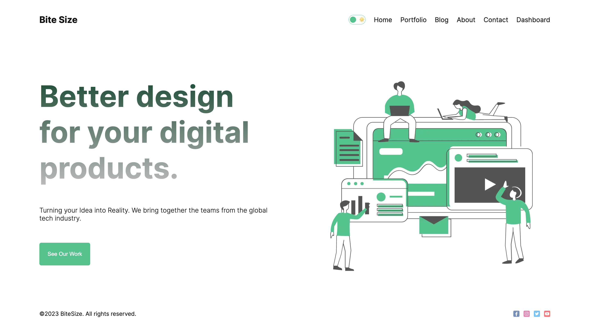
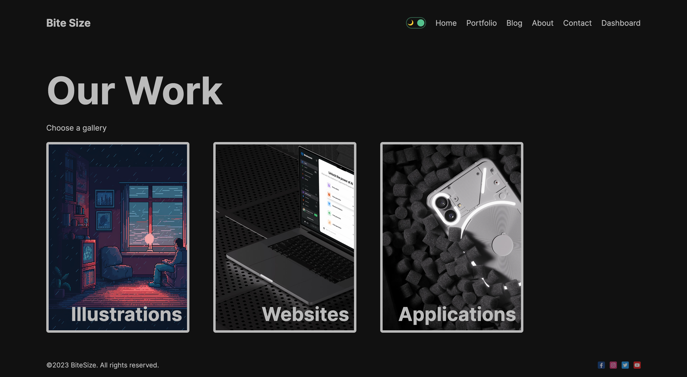

# NextJS_Blog

## Table of Contents
* General Information
* Technologies Used
* Features
* Screenshots
* Installation and Setup Instructions
* Usage
* Project Status
* Room for Improvement
* Acknowledgements
* Contact

## General Information
NextJS_Blog is a web application that allows users to create and manage a personal blog, showcase their work in a portfolio, and provides user authentication features. This project is built using Next.js, MongoDB, and various other libraries and tools.

### Purpose of this Project
The purpose of this project is to create a platform for users to share their thoughts through a blog, display their work in a portfolio, and provide user-friendly authentication options.

## Technologies Used
* Next.js
* MongoDB
* Mongoose
* React
* React DOM
* NextAuth.js
* bcryptjs
* sharp
* swr

## Features
* User registration and login with username or Google account.
* User logout functionality.
* Blog for creating and publishing posts.
* Portfolio section to showcase your work.
* Dashboard for creating and managing blog posts.

## Screenshots
Home Page - Light Mode

Home Page - Dark Mode

Blog Page

Single Post

Portfolio Page

Dashboard

## Installation and Setup Instructions
To get NextJS_Blog up and running on your local machine, follow these steps:

1. Clone this repository.
2. Make sure you have Node.js and npm installed.
3. Install project dependencies: `npm install` or `yarn install`.
4. Configure your MongoDB database connection.
5. Set up authentication settings for NextAuth.js.
6. Start the development server: `npm run dev` or `yarn dev`.
7. Access the application in your web browser at `http://localhost:3000`.

## Usage
### User Registration and Login
* Users can register with a username or log in using their Google account.

### Blog
* Create and publish blog posts.

### Portfolio
* Showcase your work in the portfolio section.

### Dashboard
* Access a dashboard for creating and managing blog posts.

## Project Status
NextJS_Blog is currently in active development.

## Room for Improvement
* Enhance the user interface and user experience.
* Add features like comments and user profiles.

## Acknowledgements
Many thanks to the Next.js and MongoDB communities for their valuable contributions and tools.

## Contact
Created by Abeer - [LinkedIn profile](https://www.linkedin.com/in/abeerwebdev/) - Feel free to contact me.
